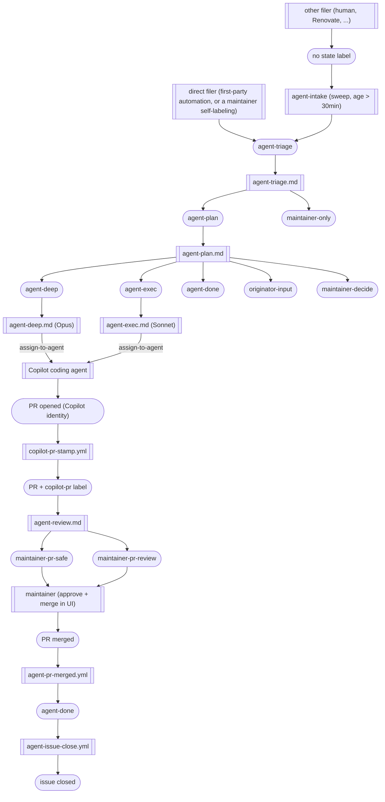

# Agent triage — state machine

Canonical reference for the issue → agent → PR state machine that runs across the triage repos (`lolay/triage`, `lolay/triage-action`). It is a port of [`lolay/nowline`'s state machine](https://github.com/lolay/nowline/blob/main/.github/AGENT_TRIAGE.md); this file (in `lolay/triage`) is the canonical copy for the triage estate, and `lolay/triage-action` carries a stub linking here.

The flow turns any GitHub issue with the right starting label into a series of small AI-driven phases: **triage** decides whether the agent should proceed; **plan** decides what to do; **implement** (deep or fast) writes the code; **review** decides whether the PR needs maintainer attention before merging. Empty PRs are forbidden by design. Humans can override or stop the flow at any step by swapping a label.

This file is for humans and agents alike — agents read it as part of their phase prompts (the prelude tells them to). When in doubt, the file you're reading is the authoritative source for *what* the flow does; the workflow files in [`.github/workflows/`](./workflows/) are the authoritative source for *how*.

## State machine

Issues start with no labels, get `agent-triage` from a detector or the issue-template checkbox, and walk forward through the phases until the issue closes (`agent-done`) or pauses on an owner-role label (`maintainer-only`, `originator-input`, `maintainer-decide`, `maintainer-pr-safe`, `maintainer-pr-review`).



## Filer types

Stadium nodes are labels/states where the issue or PR sits; double-bordered rectangles are *workers* — a human actor, a bot, a GitHub Actions workflow, or a delegated Copilot session — that move the item from one label to the next. Two creation workers feed the machine, split by behavior (does it pre-label or not), which in practice tracks trust:

- **direct filer** — creates the issue pre-labeled straight into `agent-triage`, bypassing the sweep: a trusted maintainer who self-labels at creation time, the issue-template checkbox (via `label-from-template.yml`), or any first-party detector added later.
- **other filer** — a human, or a third-party bot such as Renovate. Creates the issue with **no state label**; it waits for the `agent-intake` sweep (grace period so a human can finish editing, and so untrusted authors pass the sweep's trust gate).

Note: the `agent-intake` sweep in the diagram is inherited from nowline's design and is **not installed** in this estate. Issues without a state label stay out of the flow until a maintainer (or the template checkbox) adds `agent-triage`. Renovate's PRs never enter this flow; their autofix path is `renovate-autofix.yml` (see [Renovate autofix](#renovate-autofix)).

## Label naming convention

Three prefixes, all kebab-case, no colons:

- **`agent-…`** — the agent owns the next move. The label name matches the workflow file that fires on it (e.g. `agent-plan` triggers [`.github/workflows/agent-plan.md`](./workflows/agent-plan.md)). One-to-one mapping.
- **`originator-…`** — the issue filer owns the next move. The flow is paused, waiting on the person who filed the issue.
- **`maintainer-…`** — a repo maintainer owns the next move. Either the flow is paused for a judgment call, or a PR is ready for human merge.

Origin/metadata labels (`dependencies`, `automated`, `bug`, `enhancement`, `copilot-pr`) are not state labels; they're preserved through every transition. Renovate's `dependencies` label is one of these. `copilot-pr` is stamped on every PR authored by Copilot's coding-agent identity and persists for the life of the PR.

## Label lifecycle — replace, don't accumulate

State labels are mutually exclusive. At any moment an issue carries exactly one state label (or zero, before triage); a PR carries exactly one (`maintainer-pr-safe` or `maintainer-pr-review`) or zero pre-review.

Two glue workflows enforce the lifecycle together:

- [`.github/workflows/agent-verdict-apply.yml`](./workflows/agent-verdict-apply.yml) — the only sanctioned path for an agent (gh-aw phase orchestrator or Copilot session) to add a state label. It reads a verdict marker from a comment, validates the proposed transition against the state machine, and refuses to apply an `agent-*` verdict when any `originator-*` or `maintainer-*` label is present. Phase workflow frontmatter has no `safe-outputs.add-labels` capability.
- [`.github/workflows/agent-label-transition.yml`](./workflows/agent-label-transition.yml) — singleton cleanup. When an `originator-*` or `maintainer-*` label is added (by a maintainer or by verdict-apply), strips all other state labels (owner-role labels win unconditionally). When an `agent-*` label is added (by verdict-apply after its override check passed), strips prior `agent-*` labels only and leaves `originator-*`/`maintainer-*` labels intact as defence-in-depth.

Why this design:

- **Glance-readable state.** `gh issue list --label agent-plan` returns exactly the issues currently being planned, not the historical set.
- **Self-healing owner transitions.** A maintainer swapping `maintainer-decide` for `agent-deep` only needs to add `agent-deep`; cleanup removes `maintainer-decide` automatically.
- **Audit trail intact.** GitHub's timeline records every label add/remove, so the full lineage is recoverable from `gh api repos/lolay/triage/issues/<n>/timeline` even though the current label set only shows the current state.

## Label glossary

| Label | Where | Added by | Means | Next move |
| --- | --- | --- | --- | --- |
| `agent-triage` | issues | detector workflow, issue template checkbox, or direct filer | "triage me" | `agent-triage.md` runs |
| `agent-plan` | issues | `agent-triage.md` (or maintainer via override) | triage approved | `agent-plan.md` runs |
| `agent-deep` | issues | `agent-plan.md` (or maintainer via override) | plan routed to deep implement (Opus) | `agent-deep.md` runs |
| `agent-exec` | issues | `agent-plan.md` (or maintainer via override) | plan routed to fast implement (Sonnet) | `agent-exec.md` runs |
| `agent-done` | issues | `agent-plan.md`, implement-phase fallback, or `agent-pr-merged.yml` | terminal — work resolved | `agent-issue-close.yml` closes the issue (no-op if GitHub already auto-closed via `Closes #N`) |
| `originator-input` | issues | `agent-plan.md`, implement-phase fallback | agent waiting on issue filer | filer replies, removes label, adds `agent-plan` to resume |
| `maintainer-only` | issues | `agent-triage.md` (or maintainer via opt-out) | agent excluded / parked | none — maintainer adds `agent-triage` to re-admit |
| `maintainer-decide` | issues | `agent-plan.md`, implement-phase fallback | agent waiting on maintainer to pick a route | maintainer adds `agent-deep` / `agent-exec` / `maintainer-only` |
| `maintainer-pr-safe` | PRs | `agent-review.md` | review approved, low-risk | maintainer reviews and clicks Approve + Merge in UI |
| `maintainer-pr-review` | PRs | `agent-review.md` | review flagged concerns | maintainer reviews carefully and merges or closes |

## Override paths

Any state can be redirected by a maintainer (or the originator for their own label) via label transitions. The cleanup glue workflow handles the housekeeping; the owner just adds the new state label.

| From | To | How |
| --- | --- | --- |
| `maintainer-only` | `agent-triage` | add `agent-triage`; cleanup removes `maintainer-only`; triage re-fires |
| `originator-input` | `agent-plan` | reply to agent's questions in a comment, then add `agent-plan`; cleanup removes `originator-input`; plan re-fires. See [`.github/agent-actions/originator-input.md`](./agent-actions/originator-input.md) |
| `maintainer-decide` | `agent-deep` or `agent-exec` | add the chosen routing label; cleanup removes `maintainer-decide`; the matching implement workflow fires. See [`.github/agent-actions/maintainer-decide.md`](./agent-actions/maintainer-decide.md) |
| `maintainer-decide` | `maintainer-only` | add `maintainer-only`; flow stops |
| `maintainer-pr-safe` | manual merge | maintainer reviews and clicks Approve + Merge in the GitHub UI. See [`.github/agent-actions/maintainer-pr-safe.md`](./agent-actions/maintainer-pr-safe.md) |
| `maintainer-pr-review` | manual merge | maintainer reviews carefully and clicks Approve + Merge (or closes). See [`.github/agent-actions/maintainer-pr-review.md`](./agent-actions/maintainer-pr-review.md) |
| any state | `maintainer-only` | add `maintainer-only` to abort the flow at any phase |

The `agent-pr-merged.yml` and `agent-issue-close.yml` glue workflows are the only path to `agent-done` — maintainers don't need to add it manually, and shouldn't.

## Empty-PR ban with three-way resolution

The state machine forbids PRs with zero diff. (See `lolay/nowline` commit `8463631` for the failure mode this design replaces.) When a phase determines no work is needed, it posts a verdict comment:

| Why no PR | Verdict marker | Resulting label | Effect | Comment expectation |
| --- | --- | --- | --- | --- |
| **Resolved without action** — already implemented, duplicate, wrong repo, detector-says-no-action | `agent-verdict: agent-done` | `agent-done` | `agent-issue-close.yml` closes the issue | one-line reason + link to existing implementation / duplicate |
| **Cannot reproduce / ambiguous** | `agent-verdict: originator-input` | `originator-input` | issue stays open, awaits filer | `## What I tried` + `## What I need from you` |
| **Multi-option / hard-rule blocks action** | `agent-verdict: maintainer-decide` | `maintainer-decide` | issue stays open, awaits maintainer pick | numbered options with trade-offs and a recommendation |

The verdict marker is the literal plain-text line `agent-verdict: <label>` (no backticks, no HTML comment, no code fence) and must be the **first non-blank line** of the comment body. `agent-verdict-apply.yml` reads it, validates the transition against the state machine, and applies the label. The plain-text form is required because gh-aw's safe-outputs content sanitizer transforms XML/HTML-comment syntax into a custom self-closing-tag form (T6 Markdown Safety in the [Safe Outputs Specification](https://github.github.com/gh-aw/reference/safe-outputs-specification/)) that the parser cannot match.

Both `agent-plan.md` and the implement workflows (`agent-deep.md`, `agent-exec.md`) can emit any of these terminals; plan is expected to catch most cases, and the implement-phase fallback is the last-line defence if Copilot finds zero diff at the end. **For Copilot coding-agent sessions**: when the diff is empty after attempting the plan, post a comment with the appropriate verdict marker instead of opening a zero-diff PR or calling `gh issue edit --add-label` directly. `agent-verdict-apply.yml` is author-agnostic — Copilot's comment flows through the same mechanism as gh-aw orchestrator verdicts.

`agent-review.md` has its own defensive empty-PR check: if a PR somehow lands with an empty diff, it emits `maintainer-pr-review` with a comment recommending the PR be closed.

## Workflows

| File | Type | Trigger | Side effects |
| --- | --- | --- | --- |
| [`.github/workflows/agent-triage.md`](./workflows/agent-triage.md) | gh-aw | `issues.labeled` for `agent-triage` | add label `agent-plan` or `maintainer-only` + comment |
| [`.github/workflows/agent-plan.md`](./workflows/agent-plan.md) | gh-aw | `issues.labeled` for `agent-plan` | add label `agent-deep` / `agent-exec` / `agent-done` / `originator-input` / `maintainer-decide` + comment |
| [`.github/workflows/agent-deep.md`](./workflows/agent-deep.md) | gh-aw | `issues.labeled` for `agent-deep` | assign-to-agent (Opus) + fallback labels |
| [`.github/workflows/agent-exec.md`](./workflows/agent-exec.md) | gh-aw | `issues.labeled` for `agent-exec` | assign-to-agent (Sonnet) + fallback labels |
| [`.github/workflows/agent-review.md`](./workflows/agent-review.md) | gh-aw | `pull_request.opened`/`synchronize` for `copilot-pr`-labeled PRs | add label `maintainer-pr-safe` or `maintainer-pr-review` + comment |
| [`.github/workflows/human-action-comment.yml`](./workflows/human-action-comment.yml) | plain | `issues.labeled` + `pull_request.labeled` for `originator-*`/`maintainer-*` | post next-action comment with link to `.github/agent-actions/<label>.md` |
| [`.github/workflows/agent-pr-merged.yml`](./workflows/agent-pr-merged.yml) | plain | `pull_request.closed && merged` for `copilot-pr`-labeled PRs | parse `Closes #N`, add `agent-done` to issue |
| [`.github/workflows/agent-verdict-apply.yml`](./workflows/agent-verdict-apply.yml) | plain | `issue_comment.created` on issues + PRs | parse verdict marker from comment; check state-machine allowed-list + `originator-*`/`maintainer-*` override; apply proposed state label via `GH_AW_AGENT_TOKEN` so downstream phase fires |
| [`.github/workflows/copilot-pr-stamp.yml`](./workflows/copilot-pr-stamp.yml) | plain | `pull_request.opened` by Copilot identity | add `copilot-pr` metadata label; the only place in the estate that checks bot identity |
| [`.github/workflows/copilot-pr-validate.yml`](./workflows/copilot-pr-validate.yml) | plain | `pull_request.labeled` for `copilot-pr` + `synchronize`/`ready_for_review` | close PR + relabel linked issue to `originator-input` if any of the 3 contract checks fail (non-empty diff, `Closes #N`, `Assisted-by:` in body) |
| [`.github/workflows/agent-issue-close.yml`](./workflows/agent-issue-close.yml) | plain | `issues.labeled` for `agent-done`, gated by `state == 'open'` | `gh issue close $ISSUE` |
| [`.github/workflows/agent-label-transition.yml`](./workflows/agent-label-transition.yml) | plain | any `agent-…` / `originator-…` / `maintainer-…` label add | remove all other state labels from target |
| [`.github/workflows/renovate-autofix.yml`](./workflows/renovate-autofix.yml) | plain | `workflow_run` of `ci` completed with failure on a `renovate/*` branch | disable auto-merge, ask Copilot (`@copilot` comment via `GH_AW_AGENT_TOKEN`) to fix the failure; at most once per commit, three times per PR |
| [`.github/workflows/copilot-setup-steps.yml`](./workflows/copilot-setup-steps.yml) | Copilot | read by the Copilot coding agent before each session | provisions the repo toolchain so Copilot can run `make pre-commit` |
| [`.github/workflows/shared/agentic-prelude.md`](./workflows/shared/agentic-prelude.md) | gh-aw shared | imported by phase workflows | the shared rules every phase respects |

## Compiling the gh-aw workflows

The five phase workflows are gh-aw sources (`.github/workflows/agent-*.md`) compiled to `.lock.yml` files that GitHub Actions actually runs. The phase prompts (`.github/agent-prompts/`) and the body of the shared prelude are pulled in at runtime (`{{#runtime-import ...}}`), so **editing them needs no recompile**; editing the frontmatter of a workflow or of the prelude does.

- `make aw-compile` downloads the pinned gh-aw compiler (`GH_AW_VERSION` in the `Makefile`) and regenerates the lock files.
- `make aw-check` recompiles and fails if any lock file changed. CI runs it, so a stale lock file cannot merge.
- Renovate tracks `GH_AW_VERSION` in its own ungrouped PR. That PR fails `aw-check` until the lock files are regenerated, which is exactly what `renovate-autofix.yml` asks Copilot to do.

nowline's `agent-aw-update.yml` (weekly `gh aw update --all`) is not ported: these workflows have no upstream `source:` pin, so it would always be a no-op. The compiler pin above plays that role.

## Renovate autofix

Renovate PRs are not part of the issue state machine. Two things cover them:

1. The shared Renovate preset (`lolay/triage` `.github/renovate-shared.json`) assigns every Renovate PR to `copilot-swe-agent[bot]`, as nowline does.
2. `renovate-autofix.yml` watches the `ci` workflow. When a run on a `renovate/*` branch fails, it disables GitHub auto-merge on that PR (so fixes made by Copilot always get a human Approve) and posts an `@copilot` comment asking for a minimal fix that keeps `make pre-commit` green. It posts at most once per head commit and three times per PR; after that a maintainer takes over.

## Entry points

There is no detector allowlist in this estate. An issue enters the flow when it gets `agent-triage`, either from the "Let an AI agent take a first pass" checkbox in the issue templates (`label-from-template.yml`) or from a maintainer adding the label. `maintainer-only` remains the opt-out.

## Empty-PR ban — extended notes

The empty-PR ban is enforced at three layers:

1. **Prompt discipline.** `agent-plan.md`'s decision tree forces the planner to pick a terminal before routing to implement. Cases (a)/(b)/(c) cover the no-work-needed scenarios explicitly.
2. **Implement-phase fallback.** `agent-deep.md` and `agent-exec.md` instruct the delegated Copilot session to post a verdict-marker comment (`agent-verdict: agent-done` or `agent-verdict: originator-input`) instead of opening a zero-diff PR. `agent-verdict-apply.yml` picks up the verdict and applies the label.
3. **Review-phase defensive check.** `agent-review.md` flags any zero-diff PR that somehow slipped through and routes it to `maintainer-pr-review` with a recommendation to close.

Together these prevent the failure mode where a detector files an issue, the agent opens a PR with no actual diff, and CI auto-merges nothing into main.

## One-time repo-settings checklist

Apply to `lolay/triage` and `lolay/triage-action` (and any repo added to the estate later).

- **Branch protection on `main`** requiring the repo's CI checks. nowline's ruleset spec ([`ops/branch-policies.md`](https://github.com/lolay/nowline/blob/main/ops/branch-policies.md)) is the reference. Copilot cannot approve its own PR, so a maintainer still clicks Approve + Merge on every agent PR.
- **Repo settings**: `allow_auto_merge: true` (for Renovate's `platformAutomerge` on minor/patch PRs), `allow_squash_merge: true`, `delete_branch_on_merge: true`. Agent PRs never auto-merge.
- **Secrets** (three per repo, or org secrets scoped to these repos):
  - `GH_AW_AGENT_TOKEN` — fine-grained PAT (resource owner `lolay`) with Repository permissions Actions / Contents / Issues / Pull requests: Read and write. Used by `safe-outputs: assign-to-agent` and by every glue workflow whose label or comment must trigger another workflow.
  - `GH_AW_GITHUB_TOKEN` — same shape as `GH_AW_AGENT_TOKEN` (the same token value works). Used by gh-aw's other `safe-outputs:` writes. Must not be `GITHUB_TOKEN`: GitHub suppresses workflow triggers from `GITHUB_TOKEN` events, so the next phase would never fire.
  - `COPILOT_GITHUB_TOKEN` — user-owned fine-grained PAT with Account permission Copilot Requests: Read. Authenticates gh-aw's Copilot engine; not interchangeable with the two above.
- **Org-level Copilot**: cloud agent enabled, Anthropic Claude partner agent on, repository access covering these repos.
- **Labels**: created on first use by the workflows; no manual setup needed.
- **Issue templates**: `bug_report.yml` and `feature_request.yml` include the "Let an AI agent take a first pass" checkbox.

## Audit trail recovery

The current label set on an issue or PR shows the current state but elides history (because cleanup removes prior state labels). To recover the full lineage:

```bash
gh api repos/lolay/triage/issues/<n>/timeline --paginate \
    --jq '.[] | select(.event == "labeled" or .event == "unlabeled") | {event, label: .label.name, actor: .actor.login, created_at}'
```

Every label add and remove event is durable in the timeline. Every comment that an `agent-*` workflow posts is durable in the issue body. Together they reconstruct what the agent saw, what it decided, and when. Searches like `is:closed label:agent-done` find every issue that resolved through the flow regardless of which terminal path it took.

## Troubleshooting

- **Issue stuck on `agent-plan` for >30 minutes.** The plan phase uses Opus and can take a few minutes, but >30m suggests the workflow failed to start. Check `gh run list --workflow=agent-plan.md --limit 5` for the run. If it's missing, the trigger condition probably didn't match — verify the issue carries `agent-plan` and no skip-gate label.
- **Plan re-fires repeatedly.** Plan re-fires whenever its trigger label is re-added. If a maintainer keeps swapping `originator-input` → `agent-plan` without the filer responding to the agent's questions, the plan will keep producing the same `originator-input` output. The right move: the filer replies to the questions in a comment, *then* the label is swapped.
- **Issue closed but `agent-done` not present.** GitHub's `Closes #N` auto-close fires before `agent-pr-merged.yml` can add the label, depending on race ordering. In that case `agent-pr-merged.yml` adds `agent-done` post-close; the `agent-issue-close.yml` workflow is a no-op when the issue is already closed. Both terminals are reachable; search by `is:closed label:agent-done` for the canonical query.
- **Two phase workflows ran on the same issue back-to-back.** Expected if a maintainer added two labels in quick succession or if a workflow re-fired. The cleanup workflow ensures the state label set ends as a singleton; intermediate phases that ran before the wrong label was removed are harmless (they're judgment-only — no PR was opened from them).
- **Copilot session opened a PR but `agent-review.md` didn't fire.** First check whether `copilot-pr-stamp.yml` ran: `gh run list --workflow=copilot-pr-stamp.yml --limit 5`. If stamp didn't run, the PR author wasn't a recognised Copilot identity — update the `if:` in `.github/workflows/copilot-pr-stamp.yml` to include the new identity literal (the only place the check lives). If stamp ran and the `copilot-pr` label is present on the PR, check `gh run list --workflow=agent-review.md --limit 5` — the review workflow's `if:` is `contains(labels, 'copilot-pr')`, so the label being present should be sufficient. Also check the `bots:` list in `agent-review.md` — it's retained as defense-in-depth; if gh-aw's pre-activation gate rejects the PR, add the new bot identity there too.
- **PR was auto-closed by `copilot-pr-validate.yml`.** The validate workflow enforces three checks on every `copilot-pr`-labeled PR: (1) non-empty diff — if Copilot opened a zero-diff PR, the implementation phase should have emitted `agent-done` or `originator-input` instead; re-add the correct label to the issue and close the PR manually if needed; (2) `Closes #N` in the PR body — add the missing reference and `gh pr reopen <PR>` to re-trigger validation; (3) `Assisted-by: <model>` in the PR body's `## AI assistance` section — add the missing line and reopen. After fixing the PR body, push a new commit or reopen the PR to trigger the `synchronize`/`ready_for_review` re-validation run.
- **Verdict suppressed by owner-role override.** An `agent-verdict: agent-*` comment was posted but the issue (or PR) already carries an `originator-*` or `maintainer-*` label applied by a maintainer to take the work offline. `agent-verdict-apply.yml` detects the override and posts a follow-up comment naming the offending label. To resume the agent flow, a maintainer removes the owner-role label and adds the desired `agent-*` label (or re-adds `agent-triage` to restart from Phase 1). The cleanup workflow's refined behaviour (don't strip `originator-*`/`maintainer-*` when adding `agent-*`) is the belt-and-suspenders here.
- **Verdict rejected: not allowed from current state.** The proposed verdict isn't in the allowed-list for the issue/PR's current state. Examples: `agent-verdict: maintainer-pr-safe` posted on an issue (PR-only verdict), or `agent-verdict: agent-plan` posted on an issue already labeled `agent-deep`. The state-machine case statement in `agent-verdict-apply.yml` is the canonical encoding; check it against the state diagram above. To recover, post a new comment with a valid verdict for the current state, or transition manually via label-swap.
- **Verdict silently dropped (marker mangled).** If your agent emits the marker but `agent-verdict-apply.yml` logs `No verdict marker on first non-blank line; treating as regular comment` and never posts a follow-up, the marker likely got transformed by gh-aw's safe-outputs content sanitizer. The marker must be the literal plain-text line `agent-verdict: <label>` — no backticks, no HTML comment, no code fence. Check the rendered comment body on the issue/PR (not the agent's intended output) to see what landed.

## FAQ

**Why split implement into two phases (`agent-deep` and `agent-exec`)?** gh-aw's `model:` is static frontmatter — you can't pick a model at runtime based on a routing label. The split lets the plan phase choose Opus (deep, thorough) for genuinely tricky changes and Sonnet (fast, cheaper) for mechanical work. The two implement workflows differ only in their model and their trigger label.

**Why is judgment ≠ implementation?** The structural guarantee from `safe-outputs:` is the design's foundation: judgment phases physically cannot open PRs or modify code. Even if a prompt confuses the model into "wanting" to write code, the workflow's permissions don't allow it. Same is true for the review phase — it can label and comment, period.

**Why keep the deterministic chokepoint (`agent-verdict-apply.yml` + `agent-label-transition.yml`) instead of re-enabling gh-aw native `safe-outputs.add-labels` now that auto-merge is gone?** Considered and rejected, the second reason decisive:

- **Security was only a secondary driver.** Removing `agent-merge` shrinks the blast radius of a mislabel (worst case is now "wrong phase runs / wrong confidence label," never an unattended merge), but `agent-verdict-apply.yml` + `agent-label-transition.yml` exist for state-machine validation, human-override protection, the Copilot-session label path (Copilot has no safe-outputs), and `GITHUB_TOKEN` loop-prevention — none of which auto-merge retirement changes.
- **Determinism of label side effects (decisive).** AI phases are not reliable at *performing* label mutations in the right order — regardless of prompt they will add the next label but forget to strip the prior one, apply two state labels at once, or violate the singleton invariant. The design constrains the agent to emit exactly one verdict marker (one decision) and lets deterministic code own every add/remove, ordering, and the singleton guarantee. Native `add-labels` hands side-effecting back to the model and reintroduces the exact inconsistency this glue prevents.

**Why preserve origin labels (`dependencies`, `bug`, etc.)?** They're metadata about *where the issue came from*, not state. The cleanup workflow only touches `agent-…`, `originator-…`, and `maintainer-…` labels. This means `is:closed label:bug label:agent-done` shows every bug that resolved through the agent flow.
