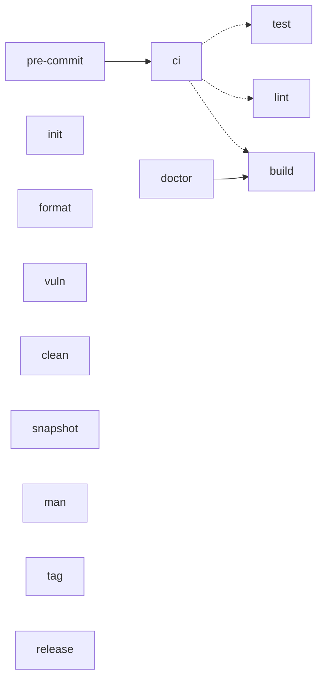

# Makefile Reference

The [`Makefile`](./Makefile) is the single source of truth for build / lint /
test / release command strings. Humans, local agents, cloud agents, and CI all
run the same verbs — the CI workflow calls `make ci`, so a green `make ci`
locally means the same checks CI runs. Run `make help` for the quick target
list; this file is the narrative reference.

## Target overview

Solid arrows = hard prerequisite. Dotted arrows = gate members (run in order,
each independent).

## Targets

### Develop

| Target | Description |
|--------|-------------|
| `help` | List targets (default goal) |
| `init` | `go mod download`; `INSTALL_PACKAGES=1` also installs golangci-lint |
| `build` | Compile the `triage` binary into `bin/` with build metadata stamped |
| `lint` | gofmt drift check + `go vet` + golangci-lint (hard-fails if missing) |
| `format` | Auto-fix formatting (`gofmt -w .`) |
| `test` | `go test -race -cover ./...` |
| `vuln` | `go tool govulncheck ./...` (dependency vulnerability scan) |
| `ci` | Full pre-push gate: `build` + `lint` + `test` — what CI runs |
| `pre-commit` | Alias of `ci` |
| `doctor` | Dogfood: build, then run `triage` against this repo's `triage.yaml`; `MODE=default\|release` |
| `clean` | Remove `bin/` and `dist/` |

### GitHub

| Target | Description |
|--------|-------------|
| `gh-runs-list` | In-flight Actions runs (`status != completed`); `GH_LIMIT` caps fetch |
| `gh-runs-watch` | Watch active runs to completion |
| `gh-runs-status` | Last completed run per workflow; `skipped`/`neutral` are not failures |

### Release

| Target | Description |
|--------|-------------|
| `snapshot` | Local goreleaser snapshot build (no publish) |
| `man` | Lint hand-authored man pages with `mandoc -Tlint` (best-effort) |
| `tag` | Create and push `vX.Y.Z` tag (`VERSION=x.y.z`, `CONFIRM_TAG=1`) — triggers the release workflow |

### Danger

Remote-mutating targets; each refuses to run without its `CONFIRM_*=1` variable.

| Target | Guard | Description |
|--------|-------|-------------|
| `publish-formula` | `CONFIRM_PUBLISH_FORMULA=1` | Render and push `Formula/triage.rb` to the Homebrew tap from `dist/` (`VERSION=x.y.z`) |
| `publish-scoop` | `CONFIRM_PUBLISH_SCOOP=1` | Render and push `bucket/triage.json` to the Scoop bucket from `dist/` (`VERSION=x.y.z`) |
| `release` | `CONFIRM_RELEASE=1` | Publish the release for the current tag via goreleaser |

## `make init`

Idempotent. `go mod download` is safe to re-run. With `INSTALL_PACKAGES=1`,
also installs golangci-lint into `$(go env GOPATH)/bin` when missing — the
pinned version (`GOLANGCI_LINT_VERSION`) must match the Install step in
`ci.yml`.

## `make doctor`

Builds the binary first, then dogfoods it against this repo's own
`triage.yaml`. `MODE=default` checks the day-to-day toolchain (git, gh, go,
golangci-lint, `.go-version` pin); `MODE=release` adds release-time tools
(goreleaser, etc.). Read-only — installs nothing.

## CI alignment

| Workflow | Trigger | Make targets |
|----------|---------|--------------|
| `ci.yml` | push / PR | `make ci` (+ `make vuln` as a separate job) |
| `release.yml` | tag `vX.Y.Z` or manual dispatch | goreleaser + `scripts/publish-*.sh` directly; local equivalents are `snapshot`, `release`, `publish-formula`, `publish-scoop` |

The release pipeline's bump/tag path is automated in `release.yml`
(workflow_dispatch); `make tag VERSION=x.y.z CONFIRM_TAG=1` is the manual
fallback. See `specs/releasing.md` for the full maintainer guide.
