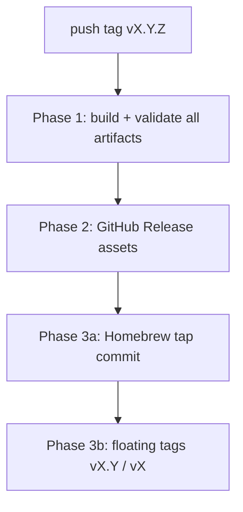

# Releasing triage

Maintainer guide for cutting a release of the `triage` CLI on `lolay/triage`.
End users: [`README.md`](../README.md). Contributors: [`CONTRIBUTING.md`](../CONTRIBUTING.md).

## Core rule: remote / marketplace pushes happen LAST

Every step that can fail locally (compile, cross-build matrix, archives,
checksums, man pages) must succeed **before** any remote go-live. Remote pushes
then run in a **fixed order** so one channel succeeding while another fails
leaves the smallest possible blast radius:



| Phase | What | Where |
| --- | --- | --- |
| **1** | Build matrix, archives, checksums, man pages bundled | Inside `goreleaser release` (no publish until green) |
| **2** | GitHub Release upload | `lolay/triage` — goreleaser `release:` |
| **3a** | Homebrew formula bump + direct commit | `lolay/homebrew-tap` — `scripts/publish-formula.sh` (after release URLs exist) |
| **3b** | Floating consumer tags `vX.Y`, `vX` | `.github/workflows/release.yml` — **last** |

**Why this order:** the tap formula references `releases/download/vX.Y.Z/…`
URLs that must resolve first. Floating tags are idempotent pointers — safe to
force-push last.

**Generalizes to m6:** the GitHub Action Marketplace publish on
`lolay/triage-action` runs only after the CLI release is fully green.
**Coordinated semver:** `triage-action` tracks the CLI — cut the action tag
(`vX.Y.Z`, floating `vX.Y` / `vX`) only after `lolay/triage` release CI is green,
since the action installs the matching CLI release asset.

## Versioning

[Semantic Versioning](https://semver.org/) — tag `vMAJOR.MINOR.PATCH` on
`lolay/triage`. Version is **git-tag-derived** (no version file bump commit):
push `vX.Y.Z` to trigger the release workflow.

| Build | `triage --version` |
| --- | --- |
| Tagged release | `triage X.Y.Z (commit …, built …)` |
| Local `make build` | `triage dev` or `triage vX.Y.Z-dirty` via `git describe` |

Floating tags (stable releases only — skip prereleases containing `-`):

| Tag | Role |
| --- | --- |
| `vX.Y.Z` | Exact release (immutable) |
| `vX.Y` | Retagged to latest `X.Y.*` on each patch |
| `vX` | Retagged to latest `X.*` |

Promoted in the `promote-floating-tags` job with plain `--force` after
goreleaser and the formula publish succeed.

## Pre-flight

On `main`, before tagging:

1. **`make ci` is green** locally (same gate as CI).
2. **`CHANGELOG.md`** has an `[Unreleased]` entry moved to `## [vX.Y.Z] - date`
   in the release commit (or tag message).
3. **`goreleaser check`** passes (`make snapshot` optional smoke).
4. **`make man`** — mandoc lint on hand-authored pages (best-effort).
5. **Secrets** configured (see below). First release also needs the Homebrew tap
   bootstrapped.

## Cutting a release

```bash
# From main, after CHANGELOG is ready:
make tag VERSION=0.1.0    # CONFIRM_TAG=1 — creates and pushes v0.1.0
```

That tag push triggers [`.github/workflows/release.yml`](../.github/workflows/release.yml):

1. **`release` job** — `goreleaser release --clean` (Phases 1–2), then
   `scripts/publish-formula.sh` (Phase 3a; skipped for prerelease tags).
2. **`promote-floating-tags` job** — `needs: release` (Phase 3b, last).

Manual re-run: **Actions → Release → Run workflow** (must be on a tag ref for
publish; normally you re-run the failed job on the tag push event).

Local maintainer publish (emergency only):

```bash
git checkout vX.Y.Z
CONFIRM_RELEASE=1 make release
CONFIRM_PUBLISH_FORMULA=1 make publish-formula VERSION=X.Y.Z
```

Requires `GITHUB_TOKEN` and `HOMEBREW_TAP_TOKEN` in the environment.

## Pipeline detail

### Makefile targets

| Target | Section | Purpose |
| --- | --- | --- |
| `snapshot` | Release | Local goreleaser build, no publish |
| `man` | Release | `mandoc -Tlint` on `man/triage.{1,5}` |
| `tag` | Release | Create + push `v$(VERSION)` (`CONFIRM_TAG=1`) |
| `publish-formula` | Release | Render + push `Formula/triage.rb` (`CONFIRM_PUBLISH_FORMULA=1`) |
| `release` | Danger | `goreleaser release --clean` (`CONFIRM_RELEASE=1`) |

### GoReleaser (`.goreleaser.yaml`)

- **Matrix:** darwin/linux/windows × amd64/arm64 (windows archives as `.zip`;
  formula covers the four unix targets only)
- **Archives:** `triage_<ver>_<os>_<arch>.tar.gz` (unix) or `.zip` (windows) +
  `checksums.txt`
- **Man pages:** `man/triage.1`, `man/triage.5` in archives and as standalone
  release assets
- **Homebrew:** `scripts/publish-formula.sh` reads unix tarball sha256s from
  `dist/checksums.txt`, renders `scripts/triage.rb.tmpl`, and commits
  `Formula/triage.rb` to `lolay/homebrew-tap` (commit message `triage X.Y.Z`)

### Git identity

Release workflow sets:

```
triage-release-bot <triage-release-bot@lolay.com>
```

## Required secrets

| Secret | Used by | Purpose |
| --- | --- | --- |
| `GITHUB_TOKEN` | goreleaser release | GitHub Release + repo contents |
| `HOMEBREW_TAP_TOKEN` | publish-formula.sh | Push to `lolay/homebrew-tap` |

Fine-grained PAT for the tap: **Contents: Read and write** on `lolay/homebrew-tap`.

## Homebrew tap bootstrap (one-time)

1. Ensure [`lolay/homebrew-tap`](https://github.com/lolay/homebrew-tap) exists with
   a `Formula/` directory (or let the first release create `Formula/triage.rb`).
2. Add `HOMEBREW_TAP_TOKEN` to repo secrets.
3. Install: `brew install lolay/tap/triage`

The formula installs the `triage` binary plus `triage.1` and `triage.5` from the
downloaded tarball (`bin.install`, `man1.install`, `man5.install`).

## Post-release verification

1. GitHub Release on `lolay/triage` has six platform archives (four unix tarballs +
   two windows zips), `checksums.txt`, and standalone `triage.1` / `triage.5`.
2. `Formula/triage.rb` on `lolay/homebrew-tap` matches the release version.
3. `brew update && brew install lolay/tap/triage` works on macOS, Linux, and WSL2;
   `brew upgrade triage` picks up the new formula commit.
4. `triage --version` matches the tag.
5. Floating tags `vX.Y` and `vX` point at the new commit.
6. `man triage` / `man 5 triage` after tap install.

## Distribution channels (v1)

| Channel | Status |
| --- | --- |
| Homebrew tap `lolay/tap/triage` | Primary (macOS, Linux, WSL2) |
| GitHub Release binaries | Primary (all six targets; native Windows via `.zip`) |
| `go install` | Deferred (m7) |
| `curl \| sh` installer | Dropped |
| scoop | Deferred (m7, Windows) — single Windows channel |
| winget / chocolatey | Deferred — scoop is the only planned Windows channel |

## See also

- [`specs/milestones.md`](milestones.md) — m5 scope; m6 action release
- [`specs/product.md`](product.md) — product distribution decisions (§3, §11)
